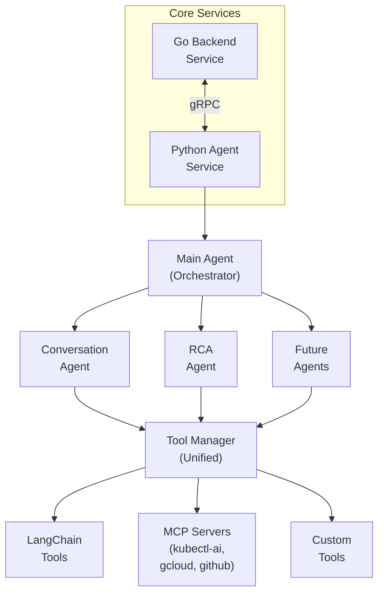

InfraGPT is an AI SRE Copilot for the Cloud that provides infrastructure management agents through Slack integration. The system consists of multiple services that work together to deliver intelligent DevOps workflows.


## WorkFlow

The services work together in this message flow:
1. User posts in Slack channel or uses CLI
2. Backend Service receives requests via Socket Mode
3. Backend Service calls Agent Service via gRPC for AI processing
4. Agent Service processes with LLM intelligence
5. Responses flow back through the system to Slack or CLI

## Features

- **🗣️ Natural Language Processing**: Convert natural language to infrastructure commands
- **🔗 Slack Integration**: Seamless Slack bot for team collaboration
- **🧠 Multi-Agent AI**: Intelligent routing and specialized agent responses
- **📊 Web Dashboard**: Modern web interface for platform management
- **🏗️ Infrastructure as Code**: Generate Terraform and other IaC
- **📈 Monitoring**: Track usage and infrastructure changes
- **🔐 Enterprise Security**: Authentication, authorization, and audit trails

## Integrations
We use a flexible data model so that we can support multiple integrations. Currently, InfraGPT supports Slack, GitHub and Terraform. 
We are actively working on adding integrations to the our stack.

## Platform Architecture

### 1. 🖥️ CLI Tool (`/cli/`)

Interactive terminal interface for infragpt

- Natural language queries for infrastructure commands
- Interactive mode with command history
- Support for OpenAI GPT-4o and Anthropic Claude models
- Install with: `pipx install infragpt`


#### Quick Start

```bash
# Install using pipx (recommended)
pipx install infragpt

# Launch interactive mode
infragpt

# Example usage
> create a new VM instance called test-vm in us-central1 with 2 CPUs
```


[**📖 CLI Documentation**](cli/README.md)

### 2. Agent Service (`/services/agent/`)
Multi-agent framework with LLM integration

- Conversation management and RCA analysis
- FastAPI + gRPC dual server architecture
- Integration with Backend service

### 3. Backend Service (`/services/backend/`)

Main Slack bot and infrastructure management service

- Slack Socket Mode integration
- PostgreSQL-backed persistence
- GitHub PR management
- Terraform code generation
- Clean architecture with domain/infrastructure layers




### 4. Console Service (`/services/console/`)
Web client interface for InfraGPT platform

- Modern React with Vite and TypeScript
- Radix UI components with Tailwind CSS
- Authentication via Clerk
- Real-time integration with platform services
## Contributing

For information on how to contribute to InfraGPT, including development setup, release process, and CI/CD configuration, please see the [CONTRIBUTING.md](CONTRIBUTING.md) file.

## License

This project is licensed under the GPL-3.0 License - see the [LICENSE](LICENSE) file for details.